# Suppliers one-screen — HANDOFF (owner: *"send back the full documentation and make sure it shows the exact result like the prototype"*) · 2026-10-07 · Fable

**This is the one document to hand a builder.** It carries the build plan with the EXACT acceptance pictures per PR (the prototype at corpus HEAD, 375 px, light and dark), and links every other document of the day. The prototype itself is the contract: open `prototypes/suppliers_page_2026-10-07_fable.html?frame=1&start=mid` at 375 and 1280, light and dark — what the builder ships must match it behaviour for behaviour.

**Sequence (owner): after the Event Hub builds are finished.**

## The documents

| Document | What it is |
|---|---|
| `prototypes/suppliers_page_2026-10-07_fable.html` | THE PLAN — the interactive prototype (gallery: phone + desktop; `?frame=1&start=mid` = the acceptance state; `&start=empty` = a new event) |
| `prototypes/suppliers_final_2026-10-07/` | 14 acceptance pictures + `00-contact-sheet.jpg` |
| `SUPPLIERS_BUILD_PLAN_2026-10-07_fable.md` | seven PRs in order, each with BUILD EXACTLY · SHIPPED TO ADAPT · DO NOT · ACCEPTANCE; builder prompts mirrored in the repo at `build-sessions/SUPPLIERS-PR0..PR6.md` |
| `SUPPLIERS_PAGE_CHECK_2026-10-07_fable.md` | every owner ruling of the day (verbatim), the shipped-vs-prototype table, the fee-rule design, the build contract, the colour legend |
| `SUPPLIERS_ACTION_MAP_2026-10-07.md` | every prototype button → shipped component · server action · table → Ugat node · SHIPPED / ADAPT / NEW |
| `BUTTON_RULE_2026-10-07_fable.md` + `BUTTON_INVENTORY_2026-10-07/` | the universal rules (buttons · numbers · meters) and the per-area inventory of every control on `origin/main` (~5,870) |
| `BOOKING_FEE_AUDIT_2026-10-07/` | the whole-app audits of the fee rules (3 and 5 landed; 1, 2, 4 pending) |
| `DECISION_LOG.md` 2026-09-20 / 2026-09-22 | the pre-existing fee-unlock rule this page mirrors — cite, never re-derive |

## Contact sheet
**Thumb bar (final, 2026-10-07 evening):**

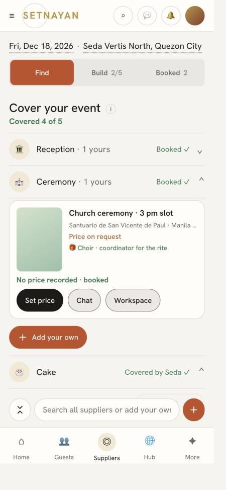

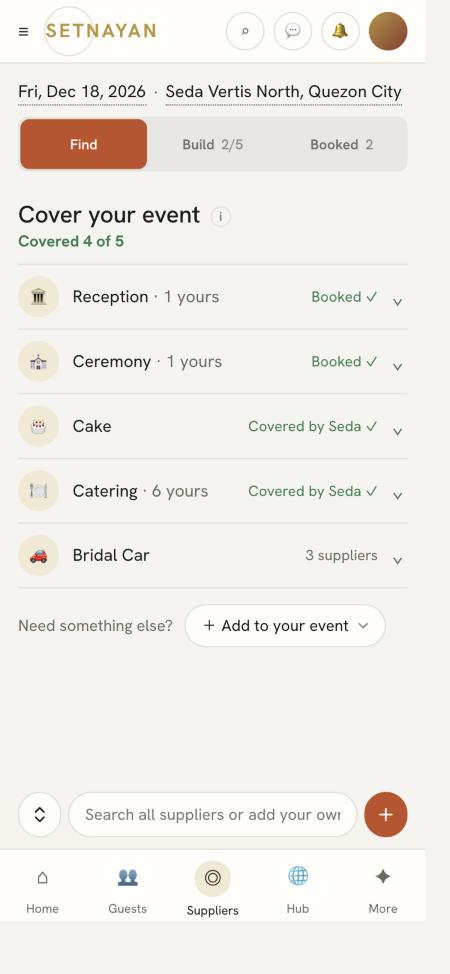

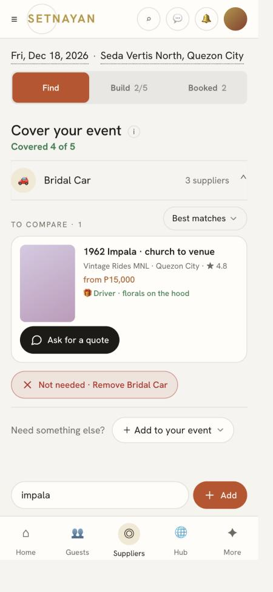

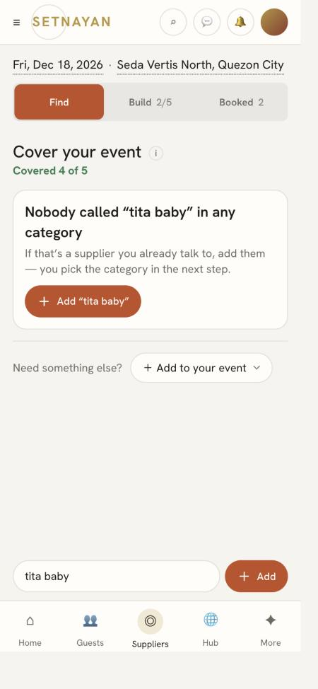

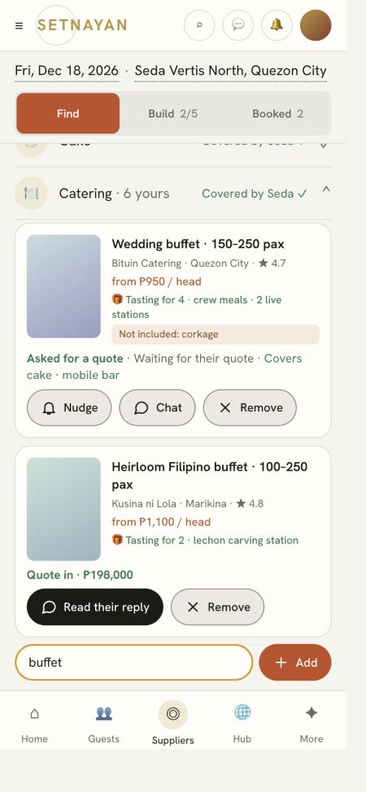

⚠ Pictures 03 and 13 show the search/add row pinned inside the category; since 2026-10-07 evening it is the THUMB BAR (see the check doc § "The category's search/add box is the thumb bar") — the prototype at corpus HEAD is the truth.

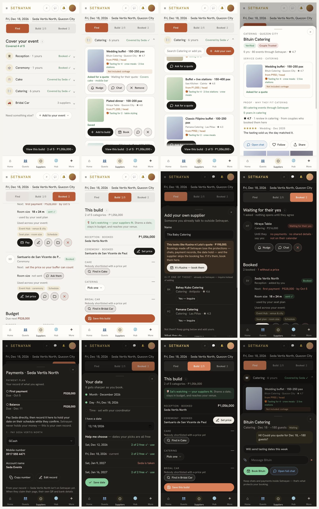

## The plan, with the exact pictures per PR

## PR0 · Foundation: ActionButton · Count · Fill · tones · Ugat nodes (no page change)
Branch `claude/foundation-buttons-counts`.

BUILD EXACTLY:
- `apps/web/components/action-button.tsx`: `<ActionButton tone icon label main quiet href|onClick disabled>` — pill 40 px, icon + `` word, `aria-label` = word. Tones: brand (the shipped CTA token `--color-mulberry`, which is terracotta #C24E25 / #E5794E — read `globals.css`, never a hex from memory), ok, info, warn, danger, neutral. `main` = filled with the tone (white word); otherwise outlined, tone ink on a 9 % tint (`color-mix`). Add `--color-ok / --color-info / --color-warn / --color-danger` to `globals.css` light + dark, with the AA contrast numbers in the comment like every other token there.
- `useFitRow(ref)` hook: after render and on resize, remove `icon-only` from every button in the row, then from the RIGHT add it to secondary (non-main) buttons one at a time until `scrollWidth <= clientWidth`. The main verb always keeps its word. Rows must be `min-width:0` grid/flex children so the measure is honest (the prototype had a bug here — see `.detail{min-width:0}`).
- `apps/web/components/count.tsx`: `<Count value format="peso|int|pct" id>` — counts from 0 on first paint, from the previous value on change (keyed by `id` in a module map so a re-render does not replay), ease-out 420–900 ms, formatted every frame; `prefers-reduced-motion` → value at once. `<Fill value id>` for bars: width grows from 0 on load, slides on change, same keying.
- Guard tests: `action-button-is-icon-and-word.test.ts` (every tone renders an svg + lbl; `icon-only` hides the word but keeps aria-label); `count-animates-only-on-change.test.ts`.
- Ugat: add nodes/joints (with REQUIRED `claims`) for `event_build_picks`, `budget_builds`, `vendor_invites` (claim links), `vendor_follows`, `event_vendor_payments`, `event_manual_vendors` in `apps/web/lib/ugat/graph.ts` — or one reasoned baseline line each. Never weaken the check.
SHIPPED TO ADAPT: `inspector-kit.tsx` (`ISegmented` / `iSegClass` tone wine = the fill colour), `.m-btn-*` in `globals.css`.
DO NOT: touch any page yet; invent a hex; add a Tailwind arbitrary `theme()` value (it is dropped).
ACCEPTANCE: a Storybook-free demo route is NOT wanted — prove with the two guard tests + a screenshot of the components rendered inside the existing `vendor-dashboard/services` page's `ServiceCardFace` footer at 375 (words) and 320 (icon-only on the right).

---

## PR1 · The shell: Find · Build · Booked as one segmented control, one body, date · place line, thumb bar, cart peek

**Acceptance pictures (the prototype — match these):**

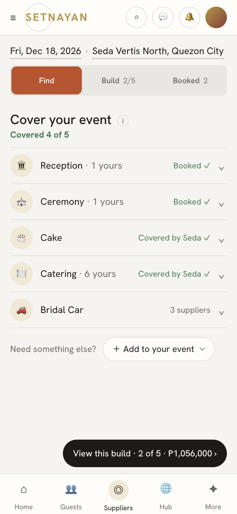
Branch `claude/suppliers-shell-three-modes`.

BUILD EXACTLY (prototype top of page, all three modes):
- Under the title row (hidden below 1024 px): the date · place line — two underlined values, `Fri, Dec 18, 2026 · Seda Vertis North, Quezon City`, each opening its sheet (sheets land in PR5; stub them to the shipped `DateEditor` / `VenuesEditor` dialogs for now). It is the ONLY place date and place appear.
- `ISegmented tone="wine"`: `Find` · `Build N/M` · `Booked N` (counts are `<Count>`). One body swaps; the segmented + facts block is `position: sticky` under the shell bar (`--stick-h` measured, as the prototype does).
- The thumb bar: `View this build · 2 of 5 · ₱1,056,000 ›` pill (black) in Find when anything is picked; Build and Booked bars come in PR3/PR4.
- Cart peek on Add to build: a 2-line black card above the thumb bar, 2.5 s, "View this build ›".
- Retire: `PlanningList` (+ `planning-list.test.ts`), the hidden `#team-find-area` lazy mount, `ChatsDoor` on this page (the shell's Messages icon is the only inbox door — owner). Re-point `your-team-phone-first.test.ts`, `suppliers-opens-fast.test.ts`, `suppliers-keeps-the-shell-bar.test.ts` at the new order.
SHIPPED TO ADAPT: `services-takeover.tsx:ServicesTakeover` (the body host), `lib/budget-build.ts` (`BB_TAB_EVENT`/`goToBuildTab` — keep the bus, drive it from the segmented), `team-rows.tsx` (its rows move under Booked in PR4; leave mounted for now).
DO NOT: build Find/Build/Booked content here (stub each body with the shipped section it replaces); add a Jump bar; add a title row on phone.
ACCEPTANCE: prototype `?start=mid` top 160 px at 375 and 1280, light/dark, matches; the three bodies swap without scroll jump; Lighthouse unchanged.

---

## PR2 · Find: the ring unfolds in place — shortlist, pinned search/add, marketplace, service cards, verbs by step, Add your own, supplier sheet, Waiting state

**Acceptance pictures (the prototype — match these):**

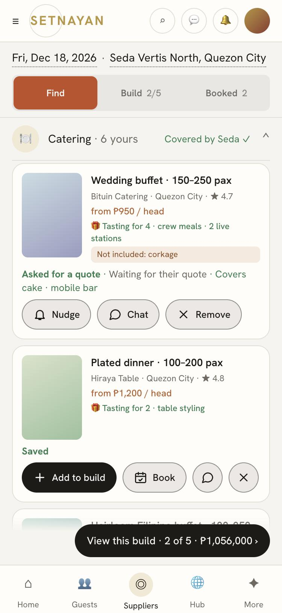

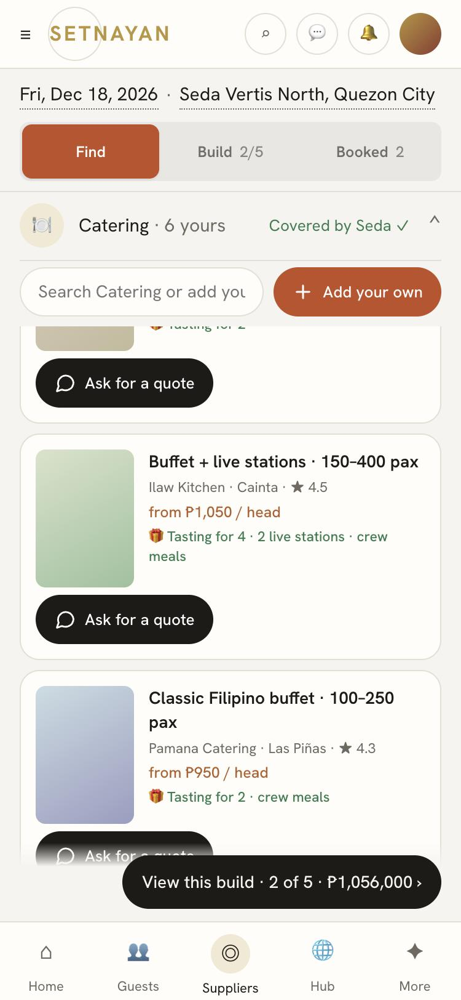

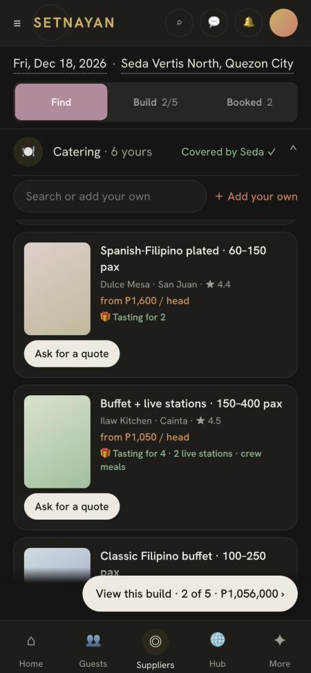

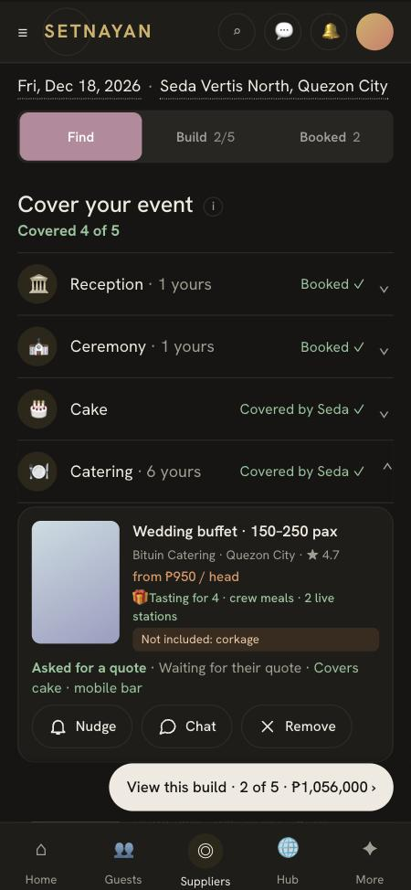

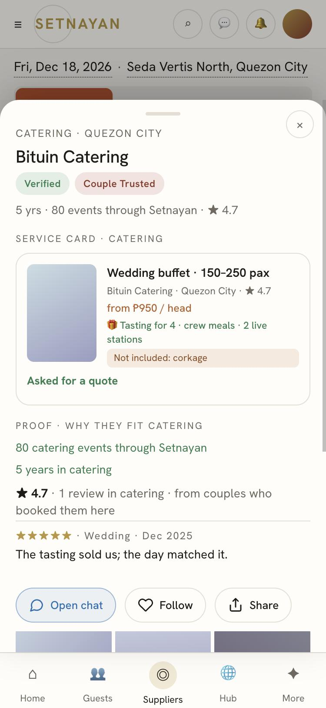

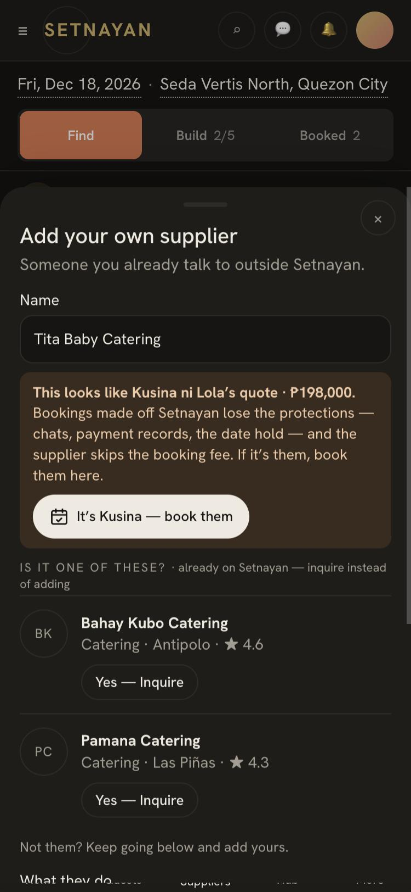

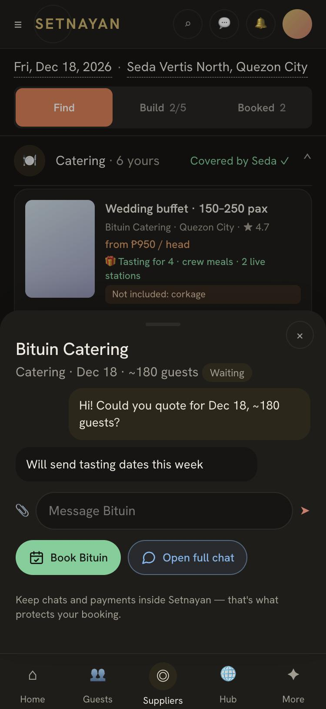
Branch `claude/suppliers-find-unfolds-in-place`.

BUILD EXACTLY (prototype Find mode, Catering open):
- "Cover your event" + `Covered <Count> of M`; the shipped starter ring for the event type as ROWS (`shortlist-categories.tsx` data), each row: icon · name · `· N yours` · state (`Booked ✓` green / `Covered by Seda ✓` / `N suppliers` / `N quote in` / `N to decide`) · chevron. Below the rows: `Need something else? ＋ Add to your event` — ONE `PickMenu` dropdown of the admin taxonomy grouped (`CATS`/`GROUPS` in the prototype are the shipped names).
- Tap a row: the icon POPS (scale 1.28 + 6° shake, 420 ms), the row settles, the body unfolds 120 ms later (`grid-template-rows 0fr→1fr`, `overflow:clip` so sticky works). One open at a time. The open row's head is sticky under the segmented block; opening lands the first card at the top (`scroll-margin-top`).
- Inside: the couple's cards first (`ServiceCardFace` shape: 80×112 cover, name + discount pill, leaf line, priceText, 🎁 includes, "Not included" box) with a state line and the verb row; then `MORE TO COMPARE · <Count>` + ONE sort dropdown (shipped set); then the pinned field `Search <Category> or add your own` + `＋ Add your own` — pinned under the row head only once scrolled past the shortlist; typing filters the MARKETPLACE of that category only (never the shortlist, never other categories); no match → `＋ Add "…"`; then the marketplace cards (only suppliers free on the date — `hideUnbookable`, the categories page must pass it too — no "Free on" line); then `✕ Not needed · Remove <Category>` unless covered.
- Verbs by step (all `ActionButton`, main = filled): marketplace → `💬 Ask for a quote`; waiting → `🔔 Nudge · 💬 Chat · ✕ Remove`; quote in → `💬 Read their reply · ✕`; date conflict → `📅 Ask about another day · ✕` (card stays, cannot be added); priced → `＋ Add to build · 📅 Book · 💬 · ✕`; in build → `✓ In your build`; own no price → `✎ Your record · ✕`; ASKED (handshake pending) → `🔔 Nudge · 💬 Chat · ✕ Withdraw`; booked → `Pay / Set price · ✎ · 💬 · 📁`.
- Press the card (not a button) → the supplier sheet: badges (`VendorBadgeRow` + `TrustedCircleBadge`) → the service card → proof: why they fit (date · venue reach · budget, from `merkado` fit) · ★ + reviews (words + date, `vendor_reviews`) · their work as photo grids by event type · venue · month (NO guest or event names) → the rest of the portfolio as `Ask about X ›` per other category → `💬 Ask for a quote / Open chat · ♡ Follow · ⇪ Share`.
- Add your own = `NewManualVendorModal` adapted: step-by-step the first time (name → "Is it one of these? Yes — Inquire" twin match via `searchMarketplaceVendorsByName` → what they do → price → booked?), then the whole record as a form. The FEE-LEAK CHECK: name or price (within the admin-set tolerance `fee_leak_price_tolerance` — add it to `platform_settings`, NO hard-coded number) matching a quote/proposal this couple already has in that category → the warn card `This looks like X's quote · ₱… — It's X, book them`; added anyway → the record is attributed SOURCED (inquiry source stays the original) and flagged (`event_manual_vendors.leak_match_vendor_profile_id` — one nullable column, migration + Ugat claim).
- The record (`Your record` / `Set price`): what they do · Also covers (one dropdown → chips, `covers_plan_groups`) · What's included (`host_inclusions`) · Costing (`updateVendorCosts` fields) · Contact · claim link QR + `⬇ Download · NFC Write to NFC (flag) · ⧉ Copy link` (`QrActions`, `createManualVendorInvite`) · PAYMENT CHANNELS: rows (channel · number/link · account name) with `✕`, and one add row (channel `PickMenu` · number · name · `＋ Add this channel`) — replaces the free-text payment note.
- Handshake: `Book` → `finalizeVendor` (marketplace: `lock_request_state=pending`; the sheet carries the shipped date-lock / lock-impact / time-slot / reservation-terms confirmations — do not drop them). Until the charge is settled (`eventAccessUnlocked` over `booking_fee_charges`) the card reads `Asked to book · waiting for their yes` and offers Nudge · Chat · Withdraw (`withdrawVendorLockRequest`) — no Pay, no record. Self-added supplier: direct (as today) unless the owner answers `claim`.
SHIPPED TO ADAPT: `shortlist-categories.tsx`, `categories/page.tsx` + `find-supplier-controls.tsx`, `category-search-overlay.tsx` (retire the overlay), `ServiceCardFace`, `vendor-badge-row.tsx`, `trusted-circle-badge.tsx`, `contact-shortlist-vendor-button.tsx` → `startServiceInquiry` (stamps the inquiry source — never bypass it), `new-manual-vendor-modal.tsx`, `self-added-contact-card.tsx`, `claim-link-share.tsx` + `qr-actions.tsx`, `lib/vendor-payment-methods.ts`, `merkado-guard-banner.tsx` (Sai's line), `accordion-lock.tsx` + `lock-milestone.tsx`.
DO NOT: invent taxonomy names; show "Free on"; filter the shortlist with the search field; put the search field above the shortlist; add a second chat door; add tiers (Basic/Essential/Complete); write a tolerance number.
ACCEPTANCE: prototype Find, Catering open, scrolled 900 px: pinned field at `--stick-h + row height`; all verbs per step match; dark mode pills correct; Add your own at ₱197,000 catering shows the Kusina ni Lola warn card.

---

## PR3 · Build: This build · All builds carousel · twin detection · Save / Save as new · Book this build

**Acceptance pictures (the prototype — match these):**

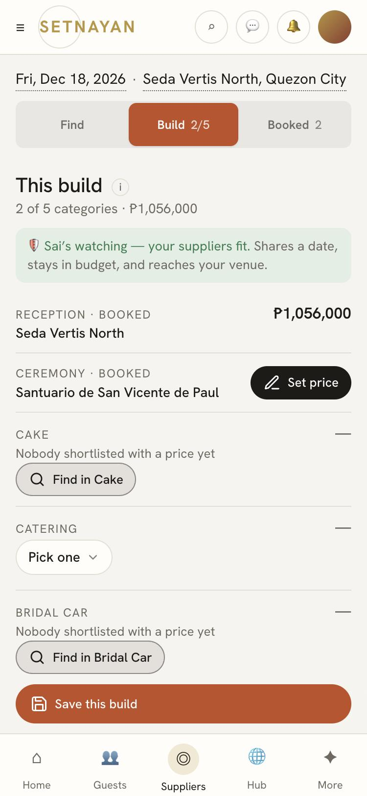

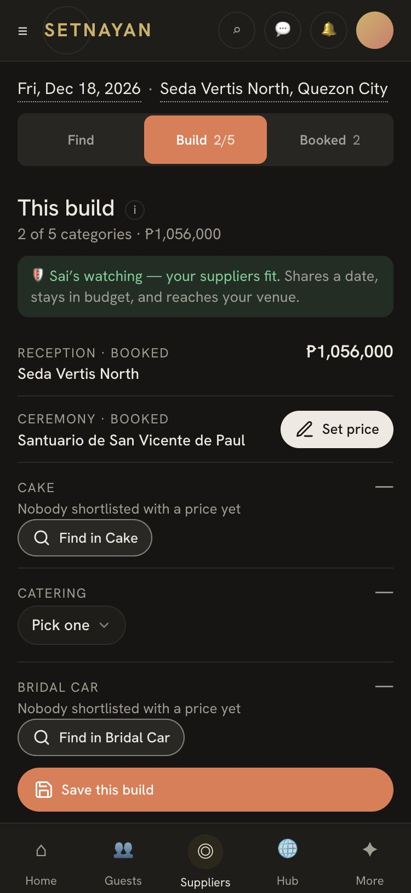
Branch `claude/suppliers-build-compare`.

BUILD EXACTLY (prototype Build mode):
- Heading: `This build` or the open build's name + `· edited`; sub `N of M categories · ₱total` (`<Count>`); Sai's guard line (`merkado-guard-banner` copy, `aiActive`).
- One line per category: label (`BOOKED` suffix when booked) · value = the booked supplier, or ONE `PickMenu` of shortlisted + priced + free-on-date candidates, or `🔍 Find in <Category>` (opens Find on that row) · amount or `✎ Set price`.
- Money block: Booked · If you book these · Budget · Buffer (`Not knowable · N of your people have no price` when any pick is unpriced — never a number) · fit line `✓ N of M priced picks are free on <date>` + `📅 Help me choose`.
- `All builds`: `<Count> builds · swipe to compare ›` then a swipe carousel (`grid-auto-flow:column; scroll-snap`), each card: name · total · `+ N without a price` · one line per category · `Free: <dates>` · Buffer · `✓ Use this build` (main) · `✕ Delete this build`; the card identical to the current picks is marked `· this build`.
- Lower bar: unchanged → `✓ Saved`; open build edited → `💾 Save` (overwrite, undo toast) · `＋ Save as new`; nothing open → `💾 Save this build` (disabled until any line is filled); plus `📅 Book this build` when any pick is unbooked.
- Twin detection: saving picks identical to an existing build refuses with `Already saved — exactly "X"` (+ `✕ Delete "X"`); the open build unchanged → `Nothing changed`. A pure compare of `snapshot.picks` (`planSaveAs` matches on name only today — extend, do not fork).
- `Book this build` = a loop over `finalizeVendor` with ONE combined confirmation that lists every date-lock / impact / slot / terms state the loop returns; a date conflict refuses that line (card says so).
SHIPPED TO ADAPT: `build-compare.tsx:BuildCompare` (Load → Use; the carousel replaces the grid), `build-locked.tsx`, `build-actions.ts:savePlanBuildNamed` + `lib/named-builds.ts:planSaveAs`, `build-pick-actions.ts` (`setBuildPick`, `applyBuildToWorking` — never re-opens a locked category), `team-controls.tsx:TeamSavePlan`, `merkado-budget-lens.tsx`.
DO NOT: show a 4-column grid on phone; derive a payment share or a budget threshold (the prototype's old 20 % and 15 % were removed as guesses); let Save create a twin.
ACCEPTANCE: prototype Build with "Garden build" opened and Catering changed: heading `Garden build · edited`, bar `Save · Save as new · Book this build`; Save → toast `Updated "Garden build"`, bar `Saved`.

---

## PR4 · Booked + Budget: rows with the next step, Waiting for their yes, room size on venues, Used across your event, Pay sheet with channels, meters

**Acceptance pictures (the prototype — match these):**

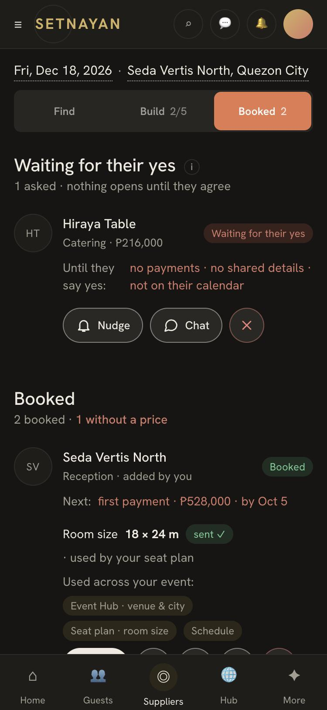

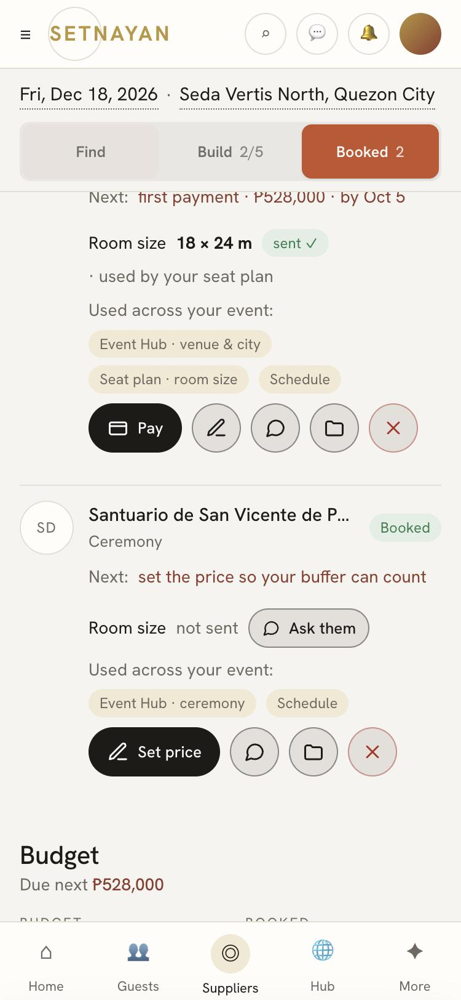

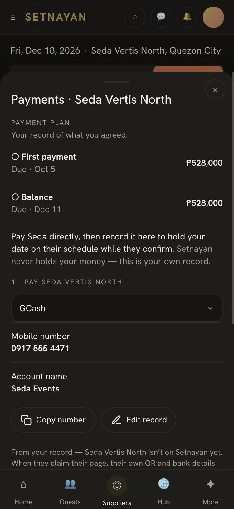
Branch `claude/suppliers-booked-and-budget`.

BUILD EXACTLY (prototype Booked mode):
- `Waiting for their yes` section first when any supplier is ASKED and the charge unsettled: `<Count> asked · nothing opens until they agree`, each row: logo · name · category · price · pill `Waiting for their yes` · `Until they say yes: no payments · no shared details · not on their calendar` · `🔔 Nudge · 💬 Chat · ✕ Withdraw`. The ⓘ copy: a waived fee (free-5 · import · promo) is a completed handshake.
- `Booked`: `<Count> booked · N without a price`; each row: logo · name · category (`· added by you`) · pill `Booked` · `Next: first payment · ₱528,000 · by Oct 5` (from the supplier's plan, `event_vendor_payment_plan`; `set the price so your buffer can count` when unpriced; `Paid in full · ₱…`) · ROOM SIZE line ONLY for reception · ceremony · accommodation (`18 × 24 m · sent ✓ · used by your seat plan`, or `not sent · 💬 Ask them` = a canned message via `sendChatMessageCore`; read side `lib/venue-room-size.ts`) — no other category gets any size line · `Used across your event:` chips (static map by category) · verbs `💳 Pay / ✎ Set price / 💳 Payments · ✎ Your record (self-added) · 💬 Chat · 📁 Workspace · ✕ Cancel booking` — Cancel maps per state to `withdrawVendorLockRequest` / `revertVendorToConsidering` / `cancelBookingAsHost` (hard delete only before a payment).
- `Budget`: `Due next ₱…`; the six figures (`<Count>`): Budget · Booked (`N booked · no price recorded`) · Paid to suppliers (`None recorded`) · Setnayan orders (`Event Hub Pro · paid`) · If you book these (`N in your build`) · Buffer (`Not knowable`); the meter (`<Fill>` ×2: spoken for · paid) + `N% spoken for · N% paid to suppliers`; then one row per booked supplier: name · `First payment · by <date>` / `No amount yet` · `💳 Pay ₱…` / `✎ Set price` / `On track`.
- Pay sheet (`VendorDirectPay` + `DepositReservation`): the plan (ladder from the supplier's plan — no 50/50 guess; the automatic 50/50 at lock is shown as "Setnayan pencils in a 50/50 split — edit it in your record" when they sent none) · `Pay <name> directly, then record it here …` · `1 · Pay`: supplier on Setnayan → ONE dropdown of their `vendor_payment_methods` (QR · bank · link), only the chosen one shown (QR + `⧉ Copy number`; bank name/number + Copy; link → `⇪ Open link` after the leaving-Setnayan confirm; the QR carries the amount) — NO Save-QR button (banned by the strip guard); self-added → ONE dropdown of the couple's recorded channels, one shown, `⧉ Copy number · ✎ Edit record`, or `＋ Add their payment details` when none · `2 · Record it here`: amount (`formatPhpInput`), reference, proof (`ChosenProofField`) · `💳 Record payment` → `recordDeposit` / `logScheduledPayment`; "Paid so far" is the SUM of `event_vendor_payments`, never a typed field. Pay is unavailable while the charge is unsettled.
SHIPPED TO ADAPT: `team-rows.tsx` + `lib/your-team-rows.ts` (rows + next step; the Nudge/Pay links become ActionButtons), `deposit-reservation.tsx`, `vendor-direct-pay.tsx`, `chosen-proof-field.tsx`, `budget-setter.tsx` (PesoInput), `BudgetPage ?part=budget` + `merkado-budget-lens.tsx` (the figures), `payment-plan-actions.ts:saveSelfAddedPaymentPlan`, `cancel-booking-button.tsx`, `withdraw-ask-button.tsx`.
DO NOT: show a size line on any non-venue row; show "Paid ₱0" as success when the read failed (honest reads); let Pay appear before settlement.
ACCEPTANCE: prototype Booked at 375: Seda row (room size, Pay main), Santuario row (no size, Set price main), Budget meter grows on first paint; Pay on Seda shows GCash then BPI by the dropdown, one at a time.

---

## PR5 · Date · place sheets, Help me choose, the room-size ask, first-visit tour

**Acceptance pictures (the prototype — match these):**

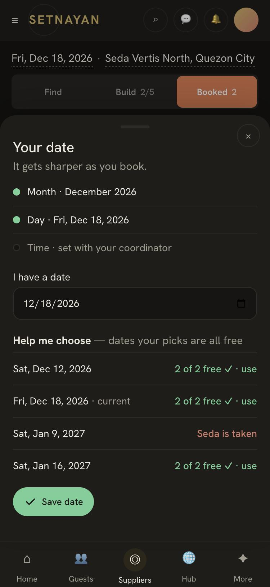
Branch `claude/suppliers-date-place-and-tour`.

BUILD EXACTLY (prototype date and venue sheets):
- Date sheet: the ladder (Year → Month → Day) from `DateEditor`; `Help me choose` = `FindYourDate` candidates filtered to days every priced pick is free (`vendors_blocked_on_date` / `service_cards_unbookable_on`); choosing a day re-runs the availability filter everywhere (cards show `Ask about another day`, Build's fit line updates). With booked suppliers, a change goes through `ask_event_date_change` / `answer_event_date_change` (J51) — draw the "asked them to move" state, never silently move.
- Venue sheet: `VenuesEditor` + `CityPick` + `AddressPinField` as the ladder (Region note: there is NO region rung shipped — only city/area; do not invent one); booked venue reads as the supplier's details; `＋ Add your own venue` → the Add flow in Reception.
- The Maker's Details tool: date and venue become READ-ONLY there — "Set in Suppliers" — WRITE THIS AS A NOTE FOR THE CONTROLLER in the PR body; do NOT edit Maker files from this PR.
- Tour: `customer_suppliers_v2` in `lib/tours.ts` (3 stops: the segmented · a category row · the build pill) via `MiniTour`. `MiniTour` is OFF globally (`TIP_POPUPS_ON=false`) — ship the tour behind it and say so in the PR body; the owner decides the flag.
SHIPPED TO ADAPT: `details-your-event.tsx` (`DateEditor`, `VenuesEditor`), `details-date-finder.tsx`, `find-your-date.tsx`, `details-date-clash.tsx`, `hub-draft-actions.ts` (draft + Apply publishes — keep that door), `lib/tours.ts`, `mini-tour`.
DO NOT: write the date directly past the draft/Apply door when a hub exists; invent a Region rung; touch Maker files.
ACCEPTANCE: prototype date sheet at 375; choosing Dec 12 flips Bituin to `Ask about another day` and the fit line to `✓ 1 of 1 …`.

---

## PR6 · The booking-fee rules, whole app: what the five audits found (filled in when `BOOKING_FEE_RULES_AUDIT_2026-10-07.md` lands)
Branch `claude/booking-fee-rules-sweep`.

SCOPE (to be completed from the audit — do not start before it is in the corpus):
- Couple side reads the charge: every couple-facing surface that shows a supplier as booked / allows a payment record / shares details consults `eventAccessUnlocked({charge})` — the list of OPEN surfaces comes from audit 4.
- Every supplier-facing surface that exposes event data calls the gate — the GAP list from audit 1.
- Every creator of an inquiry / `event_vendors` row stamps a source in both the TS allowlist and the SQL mirror `booking_fee_is_sourced_surface` — GAP/WRONG/DRIFT from audit 2.
- Every booking path mints a `booking_fee_charges` row with the right status (paid · waived_free5 · waived_import · waived_promo) — GAP/WRONG/FLAG-OFF from audit 3; the handshake flag's prod value is READ (`vercel env pull` / the page), never assumed.
- Admin: the supplier flag list — suppliers with N (admin-set) events booked on the couple's side (payments recorded / date held) and no settled charge: supplier · events · payments recorded · fee owed. One page under `/admin`, joining the four registries a new admin page needs.
- Exceptions are complete handshakes; the fee never includes Papic credits, the Papic challenge or the 3D plan — assert it in one test over `eventAccessUnlocked` + the Papic purchase path.
DO NOT: run `supabase db push` or `migration repair` against prod; weaken a guard to go green.

**Audit 5 landed (`BOOKING_FEE_AUDIT_2026-10-07/audit-5-leak-detection-and-flags.md`) — what PR6 must build for the three fee-leak rules, as measured on `origin/main`:**
- Rule "flag suppliers with booked-but-unsettled events": PARTLY — `/admin/booking-fees` lists pending charges per charge; nothing groups by supplier or counts events; a manual supplier (`marketplace_vendor_id` NULL) never gets a charge at all (`booking_fee_open_lock_charge` → `not_verified_vendor`). Build: a per-supplier roll-up on `/admin/booking-fees` — `event_vendors` with payments or `deposit_paid` and no settled `booking_fee_charges`, grouped by supplier, flagged at the admin-set N. No migration.
- Rule "manual add / budget line matches a quote": NOT FOUND — nothing compares a manual name or price to `vendor_proposals`. Build: on `addManualSupplier` and the `lib/event-costs.ts` budget-line path, match the typed name to `vendor_profiles.business_name` (reuse `searchMarketplaceVendorsByName`) and set `marketplace_vendor_id` (no charge can exist without it); a SQL matcher of name + agreed price against that event's `vendor_proposals` in the category, run at lock / deposit (migration: function only); a small evidence row of WHY a booking was re-attributed (migration), since attribution is frozen at lock.
- Rule "we saw them first": PARTLY — `vendor_profile_views(event_id, source)` is written by `recordVendorProfileView` but never read by event; `attachMarketplaceVendorToCategory` stamps `event_vendors.source='host_marketplace_search'` but opens no thread, and the only fee rule `booking_fee_attribution_for` reads `chat_threads.inquiry_source` ALONE — so a linked manual add with no thread is waived as import. Build: `booking_fee_attribution_for` also returns sourced when a `vendor_profile_views` row exists for (vendor, event) before the booking, or `event_vendors.source` ∈ {`host_marketplace_search`, `auto_cascade_from_finalize`}; mirror in `SOURCED_INQUIRY_SOURCES`; index `vendor_profile_views(event_id, vendor_profile_id)` (migration).
- Audits 1–4 (fee-lock coverage · inquiry-source stamping · booking paths mint a charge · couple side before settlement) are still running; their GAP lists append here when they land.
---

## Audit 3 landed while this was written — the charge is minted at the DEPOSIT ACKNOWLEDGEMENT, not at the yes
`BOOKING_FEE_AUDIT_2026-10-07/audit-3-booking-paths-mint-a-charge.md`: the ONLY minter is SQL `booking_fee_open_lock_charge` via `collectBookingFeeAtLock` via `runDepositAcknowledgedEffects` — it fires when the supplier acknowledges the deposit (owner ruling 5, pinned by `booking-fee-single-trigger.test.ts`). The supplier's yes (`vendor_agree_to_lock`) mints nothing. So the owner's 2026-10-07 phrasing ("their yes is the fee event") and the code disagree by ONE step: today the sequence is yes → couple pays → supplier acknowledges → charge. **Owner call for PR6: keep the charge at the acknowledgement (then the couple-side Waiting state must read "waiting for their yes AND their acknowledgement of your first payment"), or move it to the yes (a new ruling that supersedes ruling 5).**
Measured GAPs for PR6 (all against the rule): `vendor_agree_to_lock` books `contracted` with no charge · `vendor_claim_locked_qr` books `deposit_paid` with no charge and never sets `deposit_acknowledged_at` · admin `settleDepositDispute('payment_stands')` acknowledges in SQL but runs no effects and is missing from the DOORS test · `recordDeposit` holds the date with no yes and no booked-state precondition · a couple can write `status='contracted'` directly (documented residual) · **systemic: "no charge" counts as UNLOCKED in `eventAccessUnlocked` and `vendor_event_fee_gate_stage` — a booked shop with no charge gets full access** · WRONG: the onboarding wizard's marketplace pick opens no thread, so attribution falls to import and a marketplace-discovered shop is waived forever · owner call: import rows count toward the free-5 ordinal (free5 is per shop lifetime). The promo window is `platform_settings.booking_fee_free_from/until` read by `booking_fee_free_window_active()`, with no admin UI. With the handshake flag off, `finalizeVendor`, `lockPackage`, `lockDeal` and the wizard book outright; with `BOOKING_FEE_ENABLED` off nothing mints. Prod flag values were not readable from the session.

## Audit 2 landed — the inquiry source (what decides billable vs import)
`BOOKING_FEE_AUDIT_2026-10-07/audit-2-inquiry-source.md`: the fee reads **`chat_threads.inquiry_source` only** (`booking_fee_attribution_for` ← `booking_fee_open_lock_charge`); it never reads `event_vendors.source`. TS and SQL allowlists are identical (no drift). 29 creators: 18 OK · 6 GAP · 3 WRONG · 2 DRIFT.
- **Largest leak (GAP):** `attachMarketplaceVendorToCategory` / `buildFirstVenueShortlist` open no thread — find → save → book with no chat is FREE. Owner call: treat `host_marketplace_search` as sourced, or open/stamp a thread.
- **WRONG:** `contactShortlistVendor` stamps `shortlist` without checking the row's source, so a vendor-brought pick becomes billable on the first Message tap · `saveVendorToPicks` and the onboarding venue shortlist stamp `host_manual` on marketplace-discovered picks (should be `host_marketplace_search`).
- **GAP:** the lock-modal "ask the vendor", `AnonInquiryComposer` + the pending-inquiry dispatcher drop `?src` / `ref_chapter` (compose-first inquiries land as import) · the wizard's `completeVendorPickFromMarketplace` and `lockPackage` open no thread · `acceptReuseRequest` mints a new pair with no thread (waived despite "new lock = new fee").
- **DRIFT:** `startServiceInquiry` / `unlockCategoryWithInquiry` leave `event_vendors.source` NULL while the thread is sourced. Doc drift: `host_manual` / `invite_claim` are not values of the `inquiry_source` CHECK — import is NULL, `website` or `degree`. NOT FOUND: any `degree` stamper, any coordinator/admin creator.
**PR6 therefore adds: one attribution function that reads BOTH columns (thread source, then `event_vendors.source`, then `vendor_profile_views` for the event — audit 5), and the three stamp fixes above.** Audits 1 (fee-lock coverage) and 4 (couple side before settlement) are still running; they append here when they land.

## Audit 1 landed — the fee lock does NOT cover every supplier surface
`BOOKING_FEE_AUDIT_2026-10-07/audit-1-fee-lock-coverage.md`: **51 supplier-facing surfaces · 17 OK · 23 GAP · 1 PARTLY · 10 N/A.** The guard test pins only 10 pages and 5 action modules; the rest render or write with no fee check. Every OK is conditional on `fee_unlocks_event_enforced` being ON in prod (not verifiable from the session).
- **Reads without a gate:** the customer card `OverviewTab` sub-cards (`BoothPosterCard`, `BoothStudioCard`, `VendorChallengeSection`, `BoothEventSection`) · `clients/[eventId]/calendar.ics` (full timeline + venue as LOCATION) · `on-the-day` `ConfigureEventView` (returns before the gate) · the VENUE NAME shown to unsettled and inquiry-stage suppliers in `customers-roster` and `vendor-overview` (fix: show the region until unlocked) · `messages/[threadId]` `VendorEventDayPrepCta` caches the full run-of-show on the always-open thread page · **RLS `event_schedule_blocks_booked_vendor_read` (and sibling booked-vendor policies) has no fee check — a locked supplier can read the schedule table directly; only 5 RPCs use `vendor_event_fee_gate_stage`.**
- **Writes gated in the UI only (no `eventFeeBlocksAction`):** `clients/[eventId]/actions.ts` (schedule · handover · change-order · challenge · complete), `script-actions`, `production-sheet/actions`, `cocktail/actions`, `editorial-media/actions`, `finalization-actions`, `booth-event-actions`, `stage-notes-actions`, `on-the-day/actions` (song desk + 5 setters), `floorSeatByQr`, `advanceScheduleBlock` · API routes `api/vendor/papic-capture` and `api/vendor/papic-portfolio-import`.
- **Owner calls:** `manpower`, `appointments-actions`, and the public "part of the story" credit (no fee check anywhere) — gate them or not?
**PR6 scope grows accordingly: the gate becomes a server-side rule (RLS predicate + `eventFeeBlocksAction` on every event-bound write + the two API routes), and the guard test pins ALL 51, not 15.** Audit 4 (couple side before settlement) is the last one outstanding.

## Audit 4 landed — the couple's side never consults the charge
`BOOKING_FEE_AUDIT_2026-10-07/audit-4-couple-side-before-settlement.md`: **44 couple-facing surfaces · 9 OK · 33 OPEN · rows that consult the charge or `eventAccessUnlocked`: 0 of 44.** The gate is supplier-side only. The charge is minted at the supplier's deposit acknowledgement — AFTER the couple already sees "Booked".
- `lockRequestStateOf` has no settled-charge fact — fix: a state between requested and locked; "Booked" only when locked AND settled.
- `recordDeposit`, `raiseChangeOrder`, `logPayment` never read status or lock state — they can run before the yes. Fix: refuse unless locked; hide `DepositReservation` while awaiting the supplier.
- `readPublishedMethodsForCouple` shows the supplier's pay QR / account number on a mere ask — fix: no destinations until the yes.
- `acquire_schedule_pools` from `recordDeposit`: the couple's deposit alone admits the supplier to the event room — gate on agreed.
- Mood board sharing, call-time emails, "booked host" readers, colour access, part finalization, coordinator promotion: status-only or no filter — one shared booked-AND-settled reader.
- Copy: `payment_info_sent` ("is confirmed") and `payment_confirmed` ("date is locked in") are sent before any charge exists — send from the settle event.
- **Off-platform direct locks** (`finalizeVendor` self-added, wizard pick, own venue, budget fork): no charge, nothing sent to a supplier, but the couple is emailed "confirmed" — owner call: relabel "Added", or keep as the couple's own record (this is the `claim / direct` question).
- Handshake flag OFF → instant Booked + `booking_confirmed` email to the supplier, no Asked state (flag ON per `build-sessions/P0-b-SWITCHES.md`; prod env not read).
- **DB:** `event_vendors_couple_write` is FOR ALL with no column list — a couple can set `status='contracted'` on a marketplace row (per the docblock in `lib/vendor-room-access-rule.ts`; not re-verified live). Fix: a trigger requiring `lock_request_state='agreed'`.
- `vendorAgreeToLock` and the settled charge are separate events on main — the owner confirms which is "the handshake".

## All five audits are in — PR6 in one paragraph
The fee rule exists and is ON, but it holds in exactly one place: the supplier's own customer-card pages. It is **not** in RLS, **not** on 23 of 51 supplier surfaces or 11 action modules, **not** read anywhere on the couple's side (0 of 44), the only attribution source is the chat thread (so find → save → book without a chat is free), and 5 booking paths book with no charge at all. PR6 = make it one server-side predicate (settled charge) used by RLS, every event-bound write, every couple-side booked reader and the notifications; one attribution function over three sources; the five minting gaps; the admin roll-up and the leak matcher. Four owner rulings gate it: charge at the yes or at the acknowledgement · `host_marketplace_search` sourced · self-added = claim or direct · gate manpower / appointments / story credit.
